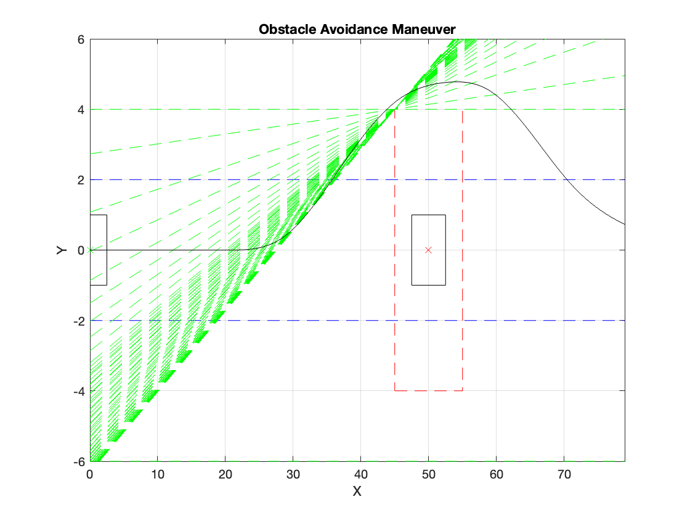
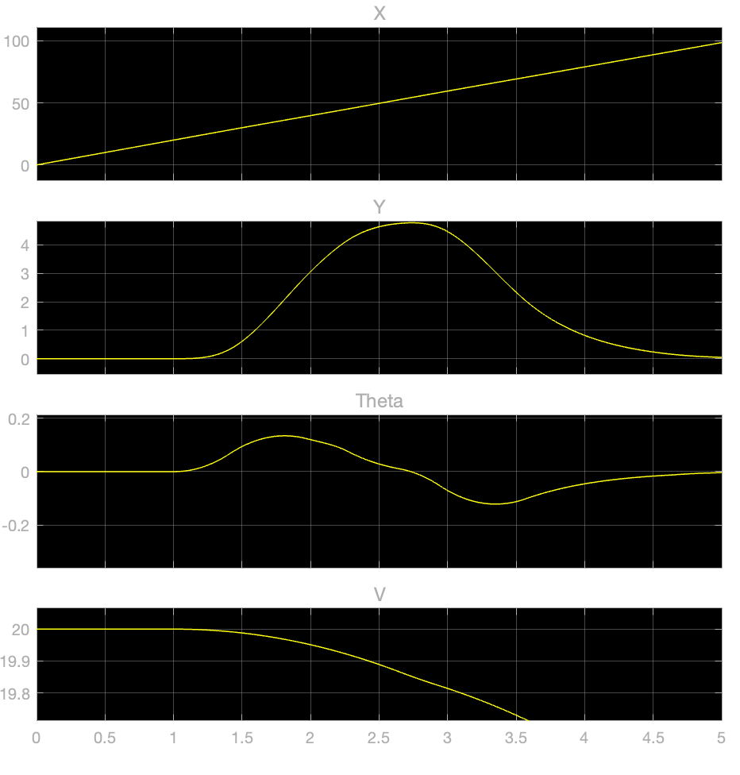
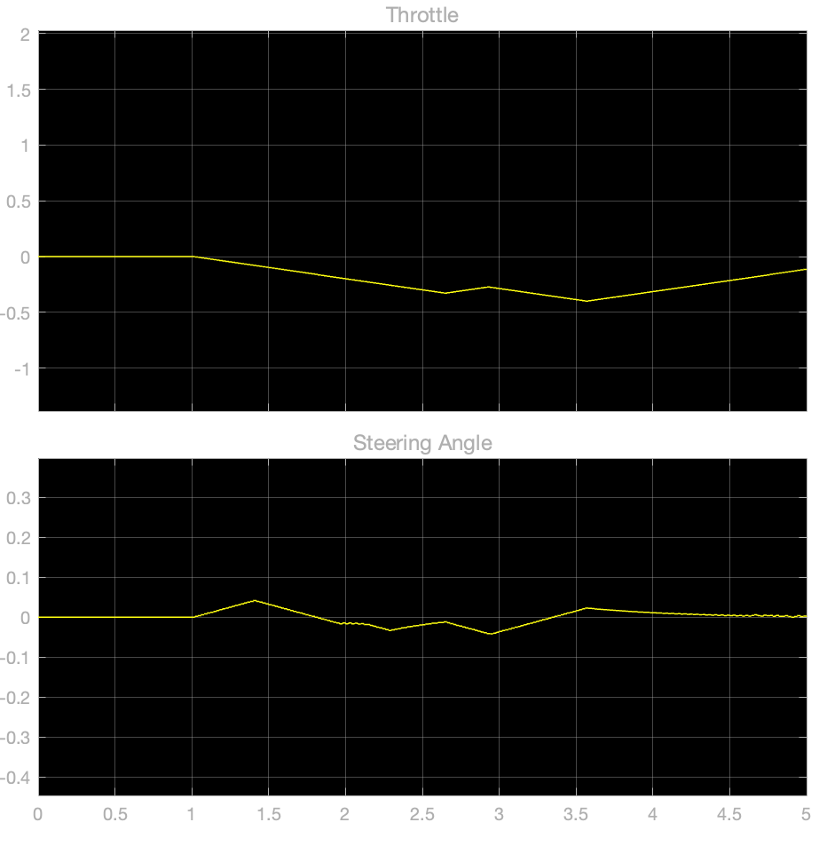

# MPC Controller for Obstacle Avoidance

## Overview

This project implements a Model Predictive Control (MPC) strategy to navigate an ego vehicle through predefined lanes while avoiding obstacles. The objective is to design an adaptive and robust control system that ensures safe and efficient navigation in dynamic and complex environments.

## Key Components

The simulation features the following core elements:

1. **Ego Vehicle Dynamics:**
   - The ego vehicle's dynamics are modeled using a discrete-time approach, capturing its position (x, y), orientation (theta), and velocity. These dynamics are essential for predicting future vehicle states and generating appropriate control inputs.

2. **Obstacle Representation:**
   - Obstacles are represented by their dimensions and positions relative to the ego vehicle. The simulation includes functions for obstacle detection and the formulation of custom constraints to prevent collisions. These constraints help maintain a safe distance from obstacles while following predefined lane boundaries.

3. **Mixed I/O Constraints:**
   - Custom input/output constraints are designed to ensure safe navigation. These constraints use information from obstacle detection and lane boundaries to adjust the control inputs dynamically, mitigating collision risks and ensuring smooth trajectory tracking.

4. **Adaptive MPC Controller:**
   - An adaptive MPC controller is implemented to optimize the vehicle's trajectory while responding to dynamic environmental changes. By using predictive models, the controller anticipates future states and calculates optimal control inputs. Through iterative optimization, the controller adapts to different conditions, enhancing obstacle avoidance performance.

5. **Simulation Visualization:**
   - Results are visualized using MATLAB plots and a Simulink model. MATLAB plots show the ego vehicle’s trajectory and obstacle avoidance behavior, while the Simulink model provides a graphical representation of the vehicle’s motion and interactions with obstacles.

## Functions

The following functions are utilized in the simulation:

1. **`discreteModel.m`:** 
   - Defines the ego vehicle's dynamics in discrete-time.

2. **`initialPlot.m`:** 
   - Plots the initial state of the ego vehicle and obstacles.

3. **`createObstacle.m`:** 
   - Generates geometric data for obstacles.

4. **`detectObstacles.m`:** 
   - Identifies obstacles near the ego vehicle.

5. **`computeObstacleConstraints.m`:** 
   - Calculates custom constraints based on detected obstacles.

6. **`main.m`:** 
   - Manages the overall simulation process by integrating the above functions.

These functions provide a modular framework for modeling, controlling, and visualizing the obstacle avoidance system, promoting code reusability and maintainability.

## How to Use

To run the simulation:

1. Ensure MATLAB is installed on your machine.
2. Clone or download this repository to your local system.
3. Open MATLAB and navigate to the directory containing the downloaded files.
4. Run the `main.m` script to initiate the simulation.

## Results

Upon executing the simulation, you will see:

- A plot displaying the ego vehicle’s trajectory and obstacle avoidance behavior.
  
- Visualization in the Simulink model, illustrating the ego vehicle’s movement and obstacle interactions.
  
  

## Future Enhancements

Future improvements could include:

- Incorporating sensor data for real-time obstacle detection and environmental awareness.
- Exploring advanced control algorithms, such as reinforcement learning or deep learning, for enhanced decision-making and trajectory planning.
- Optimizing MPC controller parameters for better performance across diverse scenarios and environments.
